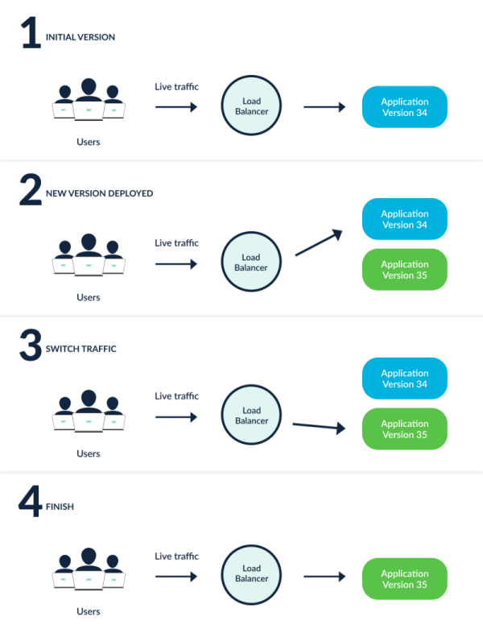
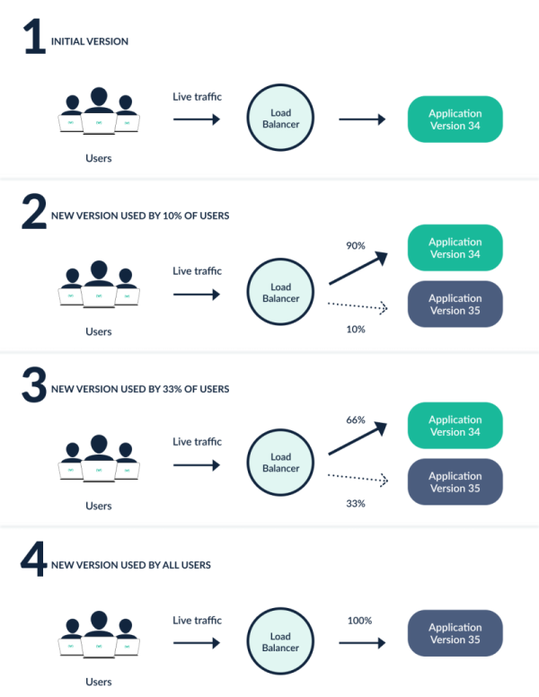

# 1. Rollout
Rollout 是 Kubernetes 工作负载资源，相当于 Kubernetes Deployment 对象。它的目的是在需要更高级的部署或渐进式交付功能的情况下替换 Deployment 对象。Rollout 提供了 Kubernetes Deployment 无法提供的以下功能：
* 蓝绿部署
* 金丝雀部署
* 与Ingress控制器和服务网格集成以实现高级流量路由
* 与蓝绿和金丝雀分析的指标提供商集成
* 根据成功或失败的指标自动升级或回滚

# 2. Progressive Delivery(渐进式交付)
渐进式交付是以受控、渐进的方式发布产品更新的过程，从而降低发布风险，通常结合自动化和指标分析来驱动更新的自动升级或回滚。渐进式交付通常被描述为持续交付的演变，将 CI/CD 中的速度优势扩展到部署过程。这是通过将新版本的曝光限制在一小部分用户、观察和分析正确行为，然后逐步增加对越来越广泛的受众的曝光，同时不断验证正确性来实现的。

# 3. Deployment Strategies(部署策略)
虽然业界使用一致的术语来描述各种部署策略，但这些策略的实现往往因工具而异。为了清楚地说明 Argo Rollouts 的行为方式，以下是 Argo Rollouts 提供的各种部署策略的实现的描述。

## 3.1 Rolling Update（滚动更新）
RollingUpdate慢慢用新版本替换旧版本。随着新版本的出现，旧版本的规模会缩小，以维持应用程序的总体数量。这是 Deployment 对象的默认策略。
## 3.2 Recreate（重建）
重新创建部署会在启动新版本之前删除应用程序的旧版本。因此，这可以确保应用程序的两个版本永远不会同时运行，但在部署期间会出现停机。
## 3.3 Blue-Green（蓝绿）
蓝绿部署（有时称为红黑）同时部署应用程序的新版本和旧版本。在此期间，只有旧版本的应用程序才会收到生产流量。这允许开发人员在将实时流量切换到新版本之前对新版本运行测试。

## 3.4 Canary(金丝雀)
金丝雀部署将一部分用户暴露给新版本的应用程序，同时将其余流量提供给旧版本。一旦新版本被验证正确，新版本就可以逐步替代旧版本。Ingress控制器和服务网格（例如 NGINX 和 Istio）可以为金丝雀提供比本地可用的更复杂的流量整形模式（例如，实现非常细粒度的流量分割，或基于 HTTP 标头的分割）。

上图显示了一个具有两个阶段的金丝雀（10% 和 33% 的流量进入新版本），但这只是一个示例。通过 Argo Rollouts，您可以根据您的用例定义确切的阶段数和流量百分比。