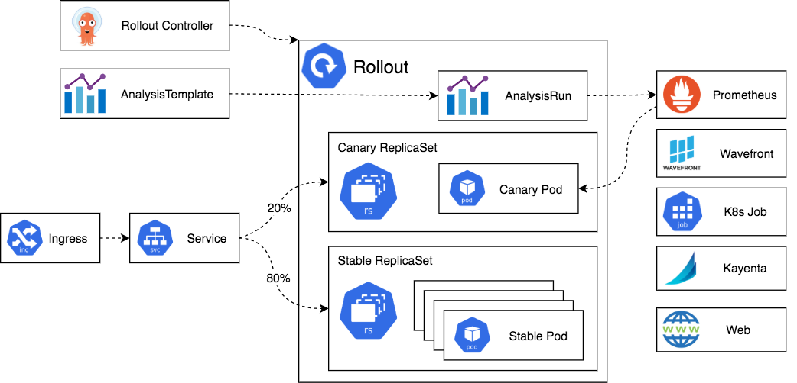

以下是参与 Argo Rollouts 管理部署的所有组件的概述。

# 1. Argo Rollouts controller
这是监视集群事件并在Rollout资源对象发生更改时做出反应的主控制器。控制器将读取Rollout的所有详细信息，并使集群达到Rollout定义中描述的相同状态。

请注意，Argo Rollouts 不会篡改或响应正常[Deployment Resources](https://argo-rollouts.readthedocs.io/en/stable/architecture/)上发生的任何更改。这意味着使用集群中安装的Argo Rollouts部署应用是一个可选的替代方式。

要在集群中安装控制器并开始渐进式交付，请参阅[安装](../2.安装/2.安装.md)页面。
# 2. Rollout resource
Rollout 资源是由 Argo Rollouts 引入和管理的自定义 Kubernetes 资源。它几乎全部与原生 Kubernetes Deployment 资源兼容，但具有额外的字段来控制高级部署方法（例如金丝雀和蓝/绿部署）的阶段、阈值和方法。

请注意，Argo Rollouts 控制器将仅响应 Rollout 源中发生的那些更改。它对于正常的Deployment资源没有任何作用。这意味着如果您想使用 Argo Rollouts 来管理Deployment，则需要将Deployment迁移到 Rollouts 。

您可以在完整的[Specification](../7.Rollout/7.2Rollout-Spec.md)页面中查看 Rollout 的所有可能选项。
# 3. 新旧版本的Replica sets

这些是标准 [Kubernetes ReplicaSet 资源](https://kubernetes.io/docs/concepts/workloads/controllers/replicaset/)的实例。Argo Rollouts 在其上添加了一些额外的元数据，以便跟踪应用程序的不同版本。

另请注意，Rollout 的replica sets完全由控制器以自动方式管理。您不应该使用外部工具篡改它们。

# 4. Ingress/Service
这是来自实时用户的流量进入集群并重定向到适当版本的机制。Argo Rollouts 使用标准的 [Kubernetes Service资源](https://kubernetes.io/docs/concepts/services-networking/service/)，但需要一些额外的元数据进行管理。

Argo Rollouts 在网络选项上非常灵活。首先，您可以在Rollout拥有不同的Service，这些Service仅适用于新版本、仅适用于旧版本或两者都适用。特别针对 Canary 部署，Argo Rollouts 支持多种服务网格和ingress解决方案，用于按特定百分比分割流量，而不是基于 Pod 计数进行简单平衡，并且可以同时使用多个路由提供商。
# 5. AnalysisTemplate 和 AnalysisRun
Analysis 是将 Rollout 连接到指标提供程序并为某些指标定义特定阈值的功能，这些阈值将决定更新是否成功。对于每项Analysis，您可以定义一个或多个指标查询及其预期结果。如果指标查询良好，则Rollout将自行进行；如果指标显示失败，则自动回滚；如果指标无法提供成功/失败答案，则暂停Rollout。

为了执行分析，Argo Rollouts 包括两个自定义 Kubernetes 资源：AnalysisTemplate和AnalysisRun。

AnalysisTemplate包含有关要查询哪些指标的说明。附加到 Rollout 的实际是AnalysisRun自定义资源。您可以在特定的 Rollout 上或在集群上全局定义一个AnalysisTemplate供多个 Rollout 共享的ClusterAnalysisTemplate. 该AnalysisRun资源的范围仅限于特定的rollout。

请注意，在rollout中使用分析和指标完全是可选的。您可以通过 API 或 CLI 手动暂停和促进部署或使用其他外部方法（例如冒烟测试）。您不需要仅仅为了使用 Argo Rollouts 就使用标准的解决方案。您还可以在rollout中混合自动（即基于分析）和手动步骤。

除了指标之外，您还可以通过运行[Kubernetes Job](../9.Analysis/9.7job)来决定部署是否成功。
# 6.Metric providers

Argo Rollouts 包括多个[流行指标提供程序](../9.Analysis/9.8web)的原生集成，您可以在Analysis资源中使用这些提供程序来自动升级或回滚部署。有关特定设置选项，请参阅每个提供商的文档。
# 7. CLI and UI (Not shown in the diagram)
您可以使用[Argo Rollouts CLI](../12.kubectl插件/12.1概述.md)或[集成 UI](../6.Dashboard/6.Dashboard.md)查看和管理 Rollouts 。两者都是可选的。