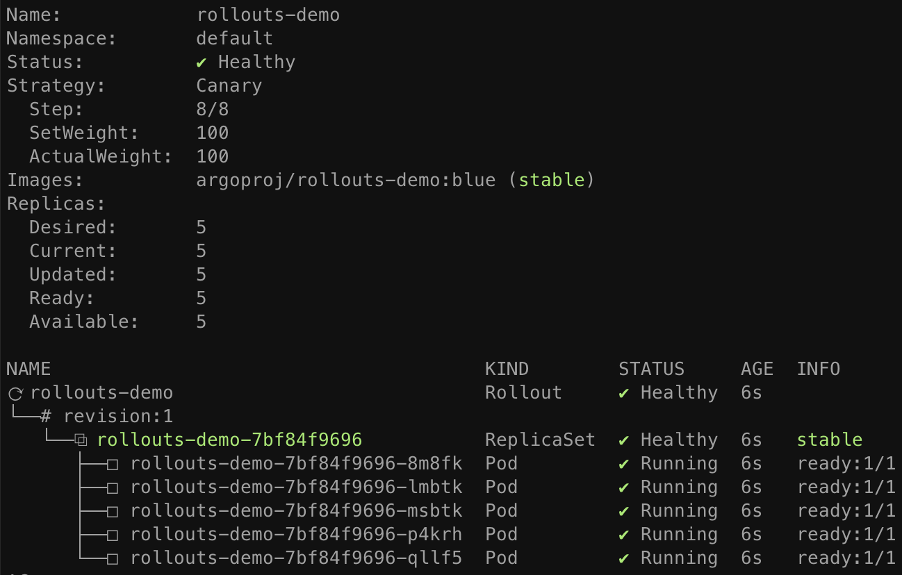
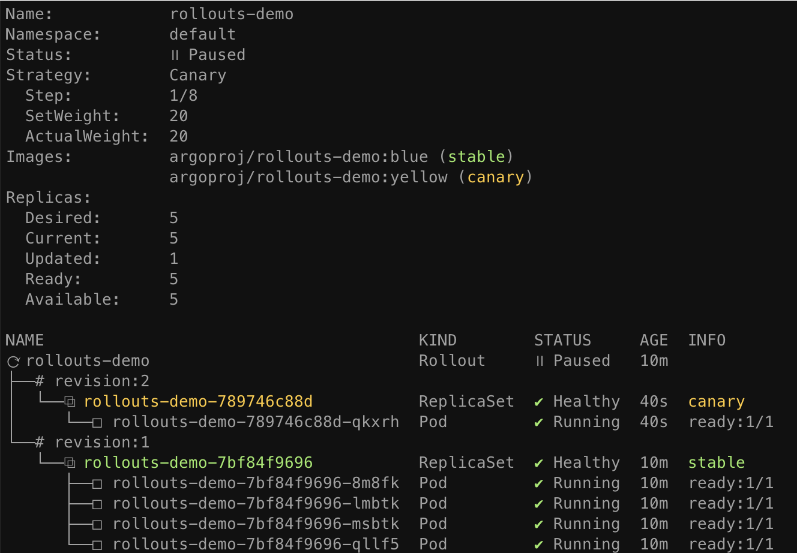
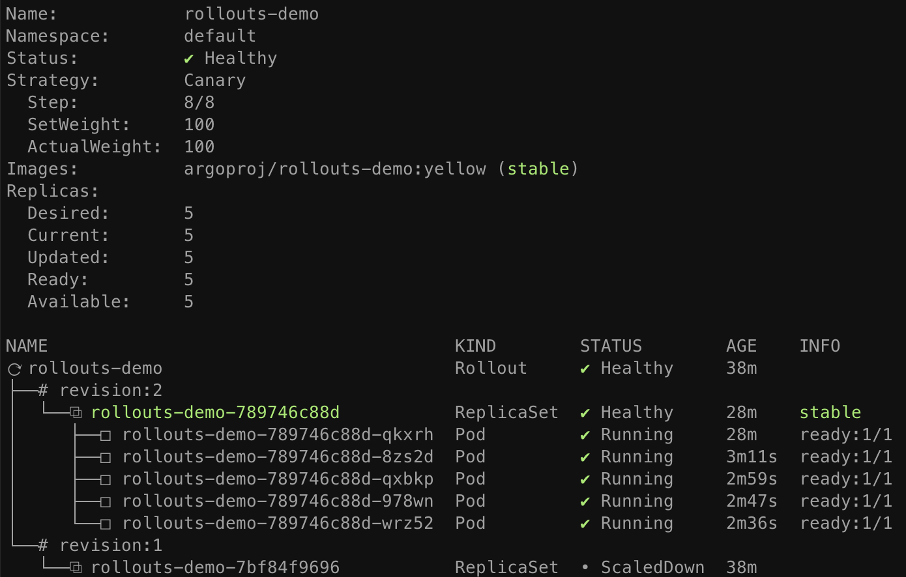
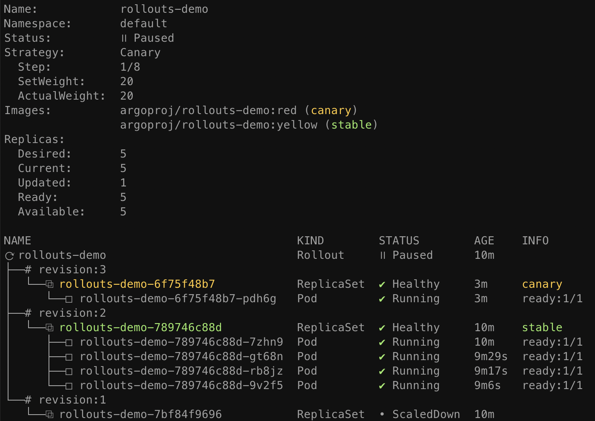
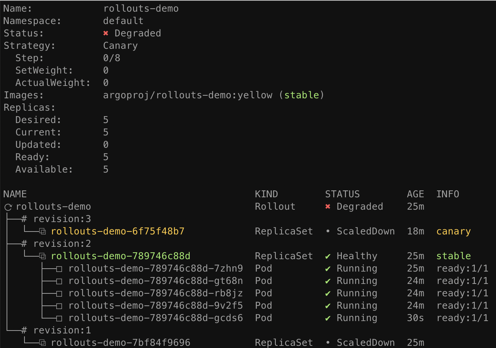
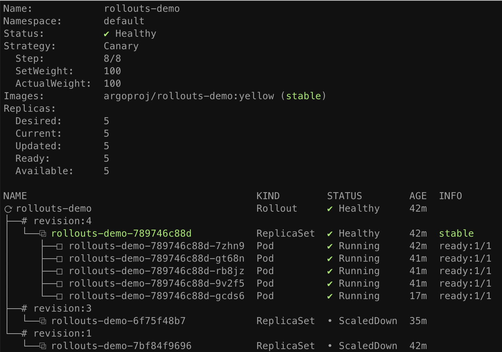

本指南将通过 Rollout 的部署、upgrade、promotion、和中止来演示 Argo Rollouts 的各种概念和功能。

# 1. 前提条件
* 安装了 argo-rollouts 控制器的 Kubernetes 集群（请参阅[安装指南](../2.安装/2.安装.md)）
* 安装了 argo-rollouts 插件的 kubectl（请参阅[安装指南](../2.安装/2.安装.md)）

# 2.部署Rollout
首先，我们部署 Rollout 资源和针对该 Rollout 的 Kubernetes 服务。本指南中的示例Rollout采用金丝雀更新策略，将 20% 的流量发送到金丝雀，然后进行手动升级，最后在升级的其余部分中逐渐自动增加流量。Rollout 规范的以下部分描述了此行为：
```yaml
spec:
  replicas: 5
  strategy:
    canary:
      steps:
      - setWeight: 20
      - pause: {}
      - setWeight: 40
      - pause: {duration: 10}
      - setWeight: 60
      - pause: {duration: 10}
      - setWeight: 80
      - pause: {duration: 10}
```
运行以下命令来部署初始Rollout 和Service：
```
kubectl apply -f https://raw.githubusercontent.com/argoproj/argo-rollouts/master/docs/getting-started/basic/rollout.yaml
kubectl apply -f https://raw.githubusercontent.com/argoproj/argo-rollouts/master/docs/getting-started/basic/service.yaml
```
任何 Rollout 的初始创建都会立即将副本扩展至 100%（跳过任何金丝雀升级步骤、分析等...），因为没有发生升级。
Argo Rollouts kubectl 插件允许您可视化 Rollout、其相关资源（ReplicaSets、Pods、AnalyseRuns），并在更改发生时呈现实时状态。要在rollout 时观看部署，请运行插件命令get rollout --watch：
```
kubectl argo rollouts get rollout rollouts-demo --watch
```

# 3. Updating a Rollout
接下来是执行更新的时候了。就像部署一样，Pod 模板字段 ( spec.template) 的任何更改都会导致部署新版本（即 ReplicaSet）。更新Rollout 涉及修改Rollout spec，通常使用更改 container image 字段更新版本，然后 kubectl apply针对新manifest运行。为了方便起见，rollouts 插件提供了一个set image命令，该命令可针对Rollout 对象实时就地执行这些steps。运行以下命令以更新 rollouts-demo Rollout使用容器的“yellow”版本：
```
kubectl argo rollouts set image rollouts-demo \
  rollouts-demo=argoproj/rollouts-demo:yellow
```
在Rollout更新期间，控制器将按照Rollout更新策略中定义的步骤进行。该示例Rollout为金丝雀设置了 20% 的流量权重，并无限期地暂停推出，直到用户采取行动取消暂停/升级Rollout。更新镜像后，再次观察 rollout，直到达到暂停状态：
```
kubectl argo rollouts get rollout rollouts-demo --watch
```

当演示 rollout 到第二步时，我们可以从插件中看到 Rollout 处于暂停状态，现在5 个副本中的 1 个运行新版本的 pod 模板，5 个副本中的 4 个运行旧版本。这相当于步骤定义的 20% 金丝雀重量 setWeight: 20。
# 4. Promoting a Rollout
rollout 现在处于暂停状态。当 Rollout 到达pause并没有设置duration的 step时，它将无限期地保持暂停状态，直到resumed/promoted。要手动将部署升级到下一步，请运行插件的promote命令：
```
kubectl argo rollouts promote rollouts-demo
```
promote后，Rollout 将继续执行剩余steps。我们示例中的其余Rollout的steps是完全自动化的，因此Rollout最终将完成步骤，直到完全过渡到新版本。再次观察Rollout，直到完成所有steps：
```
kubectl argo rollouts get rollout rollouts-demo --watch
```

>Tip:
>该promote命令还支持使用--full flag跳过所有剩余步骤和分析的功能。
一旦所有步骤成功完成，新的 ReplicaSet 就会被标记为“stable” ReplicaSet。每当rollout更新期间中止时，无论是通过失败的金丝雀分析自动中止，还是由用户手动中止，rollout都会回退到“stable”版本。
# 5. Aborting a Rollout
接下来我们将学习如何在更新期间手动中止rollout。首先，使用set image命令部署新的“red”版本的容器，然后等待rollout再次到达暂停的step ：
```
kubectl argo rollouts set image rollouts-demo \
  rollouts-demo=argoproj/rollouts-demo:red
```

这次，我们不会将rollout推进到下一步，而是中止更新，使其回退到“stable”版本。该插件提供了一个abort命令作为在更新期间随时手动中止rollout的方法：
```
kubectl argo rollouts abort rollouts-demo
```
当rollout中止时，它将扩大 ReplicaSet 的“stable”版本（在本例中为yellow image），并缩小任何其他版本。尽管 ReplicaSet 的稳定版本可能正在运行并且运行状况良好，但仍需考虑整体部署Degraded，因为所需版本（red image）不是实际运行的版本。

了使 Rollout 再次被认为是 Healthy 而不是 Degraded，有必要将所需状态更改回之前的稳定版本。这通常使用kubectl apply 应用之前的 Rollout Spec。在我们的例子中，我们可以简单地使用set image命令重新运行之前的“yellow”镜像。
```
kubectl argo rollouts set image rollouts-demo \
  rollouts-demo=argoproj/rollouts-demo:yellow
```
运行此命令后，您应该注意到 Rollout 立即变得正常，并且没有创建新 ReplicaSet 相关的活动。

当 Rollout 尚未达到其所需状态（例如，它被中止，或在更新过程中），并且重新应用stable manifest时，Rollout 会将其检测为回滚而不是更新，并将通过跳过analysis和steps来快速跟踪稳定的ReplicaSet部署。
# 6. 概括
在本指南中，我们了解了 Argo Rollouts 的基本功能，包括：

* rollout部署
* 执行金丝雀更新
* 手动promotion（推进）
* 人工abortion（中止）
此基本示例中的rollout没有利用Ingress控制器或服务网格提供商来路由流量。相反，它使用普通的 Kubernetes 服务网络（即 kube-proxy）根据新旧副本计数的最接近比率来实现近似的金丝雀权重。因此，此 Rollout 有一个限制，即通过缩放 5 个 pod 中的 1 个来运行新版本，只能实现 20% 的最小金丝雀权重。为了实现更细粒度的金丝雀，需要Ingress控制器或服务网格。

请遵循其中一份流量路由指南，了解 Argo Rollouts 如何利用网络提供商来实现更高级的流量整形。

* [ALB指南](5.3AWSALB.md)
* [应用网格指南](5.4AWSAppMesh.md)
* [Ambassador指南](52Ambassador.md)
* [Istio 指南](5.5Istio.md)
* [Multiple Providers指南](5.8MultipleProviders.md)
* [NGINX 指南](5.6NGINX.md)
* [SMI指南](5.7SMI.md)