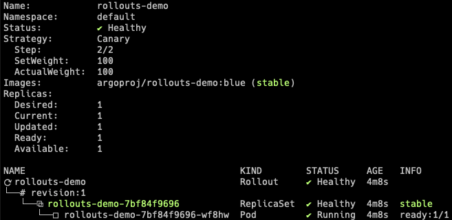
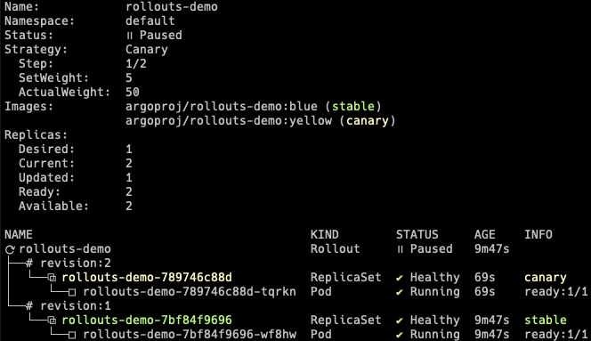

[本指南介绍了 Argo Rollouts 如何与AWS 负载均衡器控制器](https://kubernetes-sigs.github.io/aws-load-balancer-controller/v2.6/)集成以进行流量调整。本指南以[基本入门指南](5.1基础使用.md)的概念为基础。
# 1.前提条件
* 安装了 AWS ALB Ingress Controller 的 Kubernetes 集群
> Tip:
> 请参阅[负载均衡器控制器安装说明](https://kubernetes-sigs.github.io/aws-load-balancer-controller/v2.6/deploy/installation/) ，了解如何安装 AWS 负载均衡器控制器

# 2.部署Rollout, Services 和 Ingress
当 AWS ALB Ingress 用作流量路由器时，Rollout canary 策略必须定义以下字段：
```yaml
apiVersion: argoproj.io/v1alpha1
kind: Rollout
metadata:
  name: rollouts-demo
spec:
  strategy:
    canary:
      # canaryService and stableService are references to Services which the Rollout will modify
      # to target the canary ReplicaSet and stable ReplicaSet respectively (required).
      canaryService: rollouts-demo-canary
      stableService: rollouts-demo-stable
      trafficRouting:
        alb:
          # The referenced ingress will be injected with a custom action annotation, directing
          # the AWS Load Balancer Controller to split traffic between the canary and stable
          # Service, according to the desired traffic weight (required).
          ingress: rollouts-demo-ingress
          # Reference to a Service that the Ingress must target in one of the rules (optional).
          # If omitted, uses canary.stableService.
          rootService: rollouts-demo-root
          # Service port is the port which the Service listens on (required).
          servicePort: 443
...
```
Rollout 引用的 Ingress 必须具有规则与其中一项 Rollout Service相匹配的。这应该是canary.trafficRouting.alb.rootService（如果指定），否则rollout将使用canary.stableService.
```
apiVersion: networking.k8s.io/v1beta1
kind: Ingress
metadata:
  name: rollouts-demo-ingress
  annotations:
    kubernetes.io/ingress.class: alb
spec:
  rules:
  - http:
      paths:
      - path: /*
        backend:
          # serviceName must match either: canary.trafficRouting.alb.rootService (if specified),
          # or canary.stableService (if rootService is omitted)
          serviceName: rollouts-demo-root
          # servicePort must be the value: use-annotation
          # This instructs AWS Load Balancer Controller to look to annotations on how to direct traffic
          servicePort: use-annotation
```
在更新期间，将向 Ingress 注入[custom action annotation](https://kubernetes-sigs.github.io/aws-load-balancer-controller/v2.6/guide/ingress/annotations/),该annotation指示 ALB 在 Rollout 引用的稳定服务和金丝雀服务之间拆分流量。在此示例中，这些服务分别命名为：rollouts-demo-stable和rollouts-demo-canary 。

运行以下命令进行部署：
* A Rollout
* Three Services (root, stable, canary)
* An Ingress
```
kubectl apply -f https://raw.githubusercontent.com/argoproj/argo-rollouts/master/docs/getting-started/alb/rollout.yaml
kubectl apply -f https://raw.githubusercontent.com/argoproj/argo-rollouts/master/docs/getting-started/alb/services.yaml
kubectl apply -f https://raw.githubusercontent.com/argoproj/argo-rollouts/master/docs/getting-started/alb/ingress.yaml
```
应用manifests 后，您应该在集群中看到以下rollout、services和ingress资源：
```
$ kubectl get ro
NAME            DESIRED   CURRENT   UP-TO-DATE   AVAILABLE
rollouts-demo   1         1         1            1

$ kubectl get svc
NAME                   TYPE        CLUSTER-IP       EXTERNAL-IP   PORT(S)        AGE
rollouts-demo-root     NodePort    10.100.16.123    <none>        80:30225/TCP   2m43s
rollouts-demo-canary   NodePort    10.100.16.64     <none>        80:30224/TCP   2m43s
rollouts-demo-stable   NodePort    10.100.146.232   <none>        80:31135/TCP   2m43s

$ kubectl get ingress
NAME                    HOSTS   ADDRESS                                                                       PORTS   AGE
rollouts-demo-ingress   *       b0548428-default-rolloutsd-6951-1972570952.ap-northeast-1.elb.amazonaws.com   80      6m36s
```
```
kubectl argo rollouts get rollout rollouts-demo
```

# 3. 执行更新
通过更改镜像来更新rollout，并等待其达到暂停状态。
```
kubectl argo rollouts set image rollouts-demo rollouts-demo=argoproj/rollouts-demo:yellow
kubectl argo rollouts get rollout rollouts-demo
```

此时，Rollout 的金丝雀版和稳定版都在运行，其中 5% 的流量定向到金丝雀版。要了解其工作原理，请检查 ALB 的监听规则。当查看监听规则时，我们看到控制器已修改forward action权重以反映金丝雀的当前权重。
控制器已将rollouts-pod-template-hash选择器添加到服务中，并将相同的标签附加到 Pod 上。因此，您只需根据权重将请求转发到服务即可拆分流量。

随着 Rollout Steps进行，forward action权重将进行调整以匹配Steps的当前 setWeight。